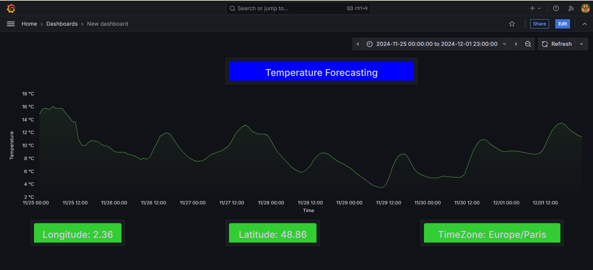

# **Weather Forecast Pipeline with Airflow, PostgreSQL, and Grafana**

This project implements a data pipeline to fetch, process, and visualize weather data. Using **Apache Airflow**, the pipeline orchestrates the extraction of weather data from an API, stores it in **PostgreSQL**, and visualizes it in **Grafana**.

---

## **Project Overview**

The project retrieves hourly temperature data for a specific location (e.g., Paris) using the Open-Meteo API. The data is then:
1. **Extracted**: Fetched from the API via an Airflow DAG.
2. **Transformed**: Cleaned and formatted into a structured format.
3. **Loaded**: Inserted into a PostgreSQL database.
4. **Visualized**: Displayed in Grafana dashboards for real-time insights.

---

## **Features**

- Automated pipeline with Airflow for ETL (Extract, Transform, Load).
- Persistent storage of weather data in PostgreSQL.
- Dynamic visualizations in Grafana.
- Dockerized setup for seamless deployment.

---

## **Project Architecture**

```plaintext
weather-forecast-project/
├── dags/                            # Directory containing Airflow Directed Acyclic Graphs (DAGs) and related scripts
│   ├── weather_pipeline.py          # Main Airflow DAG script, orchestrating the weather data pipeline
│   └── utils/                       # Directory for utility functions to support ETL tasks in the DAGs
├── init-scripts/                    # Directory for initialization scripts, such as database setup
│   └── create_table.sql             # SQL script for creating necessary tables in the database
├── logs/                            # Directory for storing logs generated by Airflow tasks
├── plugins/                         # Directory for Airflow custom plugins, if any are added to extend functionality
├── provisioning/                    # Configuration files for setting up project dependencies and dashboards
│   ├── dashboards/                  # Folder containing the configuration of Grafana dashboards
│   |   ├── dashboard.yml            # YAML configuration for Grafana dashboard settings
│   |   └── weather-dashboard.json   # JSON file with predefined weather dashboard settings for Grafana
│   └── datasources/                 # Folder containing the data source configuration files for Grafana
│       └── datasource.yml           # YAML file that defines the data source for Grafana to connect to PostgreSQL
├── .env                             # Environment variables used for configuring the project, such as API keys or database URLs
├── docker-compose.yml               # Docker Compose file for running the entire project stack, including Airflow and other services
├── Dockerfile                       # Dockerfile for building the Airflow container
├── README.md                        # Project documentation file (this file)
└── requirements.txt                 # Python dependencies required for the project to run                      
```

---

## **Technologies Used**

### **1. Apache Airflow**
- Orchestrates the ETL process.
- Manages the pipeline with DAGs (Directed Acyclic Graphs).

### **2. PostgreSQL**
- Stores historical weather data in a relational database.

### **3. Grafana**
- Creates interactive dashboards to visualize temperature trends.

### **4. Docker**
- Ensures reproducibility and easy deployment.

---

## **Setup Instructions**

### **Prerequisites**
- Docker and Docker Compose installed.
- Python 3.9 or later (for local development).
- Optional: Grafana and PostgreSQL installed locally.

### **1. Clone the Repository**
```bash
git clone https://github.com/urbainze/weather-forecast-project.git
cd weather-forecast-project
```

### **2. Run the Project with Docker**
```bash
docker-compose up -d
```

### **3. Access the Services**
- **Airflow**: [http://localhost:8080](http://localhost:8080) (default: `airflow`/`airflow`). It may take a few moments for Airflow to start, so feel free to refresh the page. Once the Airflow UI is accessible, you can begin the DAG.
- **Grafana**: [http://localhost:3000](http://localhost:3000) (default: `admin`/`admin`). After starting the DAG, navigate to the Grafana UI, go to the `Home menu`,then select` Dashboard` . From there, you’ll be able to view the dashboard I’ve created.
- **PostgreSQL**: Port `5432` (use a database client like pgAdmin or DBeaver).

---

## **Dashboard**

he is an example of dashboard



---

## **Pipeline Workflow**

1. **Extract Data**:
   - Fetch hourly weather data from the Open-Meteo API.
2. **Transform Data**:
   - Clean and format the API response into a structured table.
3. **Load Data**:
   - Insert the data into a PostgreSQL database.
4. **Visualize**:
   - Use Grafana to query the database and display temperature trends.

---


## **Future Improvements**

- Add support for multiple locations.
- Implement real-time streaming using Kafka.
- Store additional weather metrics (e.g., humidity, wind speed).
- Deploy the pipeline to the cloud using AWS or GCP.

---

## **Contributors**

- [Urbain ZE](https://github.com/your_username) - Project Lead


